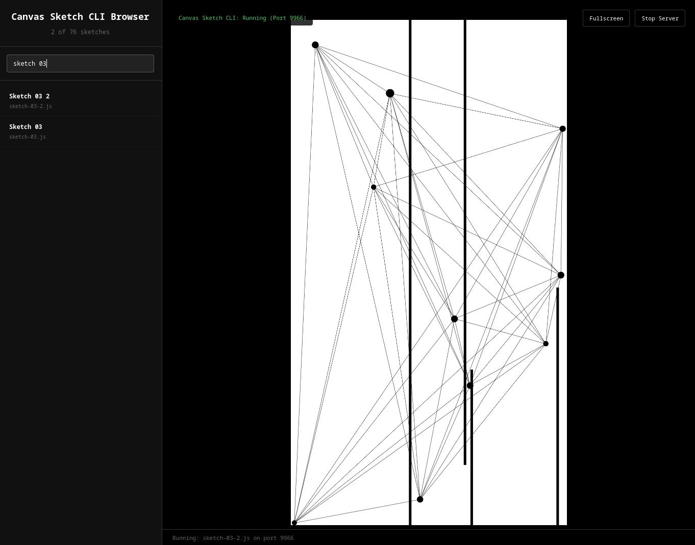

# Canvas Sketch Browser Library

A standalone web-based interface for browsing and running canvas-sketch projects from any folder.



## 🚀 Quick Start

```bash
# Start the server and open browser
node canvas-sketch-server.js
``` 

### Option 1: Standalone HTML (No Server)
```bash
# Open directly in browser
open index.html
```

### Option 2: Full Server (Recommended)
```bash
# Start the server
node canvas-sketch-server.js

# Open browser to:
# http://localhost:3335
```

## ✨ Features

### 🗂️ Folder Scanning
- **Dynamic Discovery**: Point to any folder containing `.js` sketches
- **Live Scanning**: Real-time folder scanning via server API
- **Path Flexibility**: Supports relative and absolute paths

### 🔍 Smart Browsing
- **Instant Search**: Filter sketches by name or filename
- **Live Preview**: Click any sketch to run it immediately
- **Clean Interface**: Organized sidebar with search and controls

### 🎨 Sketch Management
- **Auto-formatting**: Converts filenames to readable names
- **Status Tracking**: Shows loading states and current sketch
- **Error Handling**: Clear error messages for missing files/folders

### 🖥️ Viewing Controls
- **Fullscreen Mode**: Immersive sketch viewing
- **Refresh**: Re-scan folders for new sketches
- **Responsive Design**: Works on any screen size

## 📁 File Structure

```
sketch-library/
├── index.html          # Standalone version (mock data)
├── enhanced-index.html  # Server-powered version
├── canvas-sketch-server.js  # Node.js server for filesystem access
└── README.md           # This file
```

## 🛠️ Server Setup

The server provides real filesystem scanning:

```javascript
// API Endpoints:
GET /                    # Serve the browser interface
GET /api/scan?path=...   # Scan folder for .js files
GET /sketch/[path]       # Serve individual sketch files
```

### Dependencies
- **Node.js**: Built-in modules only (no npm install needed)
- **Modern Browser**: ES6+ support required

## 📖 Usage Examples

### Scanning Different Folders
```
../my-sketches          # Relative path
/home/user/sketches     # Absolute path
./current-folder        # Current directory
```

### Search Examples
```
"mandelbrot"     # Find Mandelbrot-related sketches
"noise"          # All noise-based sketches
"pattern"        # Pattern generation sketches
```

## 🔧 Customization

### Changing the Default Path
Edit the `value` in `enhanced-index.html`:
```html
<input value="../canvas-sketch-projects">
```

### Styling
Modify the CSS in the `<style>` section for custom themes.

### Server Port
Change the `PORT` variable in `canvas-sketch-server.js`:
```javascript
const PORT = 3335; // Change this
```

## 🌐 Browser Compatibility

- **Chrome/Chromium**: Full support
- **Firefox**: Full support  
- **Safari**: Full support
- **Edge**: Full support

Requires ES6+ features:
- Fetch API
- Arrow functions
- Template literals
- Async/await

## 🐛 Troubleshooting

### "Cannot access path" Error
- Check if the path exists
- Ensure read permissions
- Try absolute path instead of relative

### Sketches Not Loading
- Verify sketch files are valid JavaScript
- Check browser console for errors
- Ensure canvas-sketch dependencies are available

### Server Won't Start
- Check if port 3335 is available
- Try a different port in `canvas-sketch-server.js`
- Ensure Node.js is installed

## 🎯 Pro Tips

1. **Bookmark Paths**: Save frequently used sketch folders
2. **Keyboard Shortcuts**: Use Enter in the path field to scan quickly
3. **Search Operators**: Use partial names for faster filtering
4. **Fullscreen**: Press F11 after clicking fullscreen for true immersion

Happy sketching! 🎨